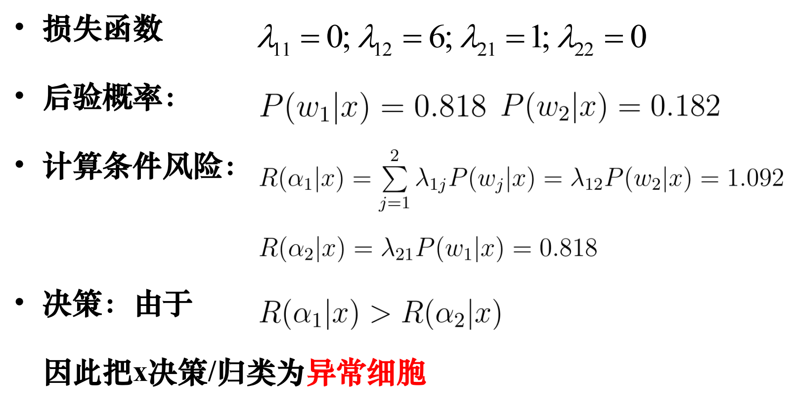
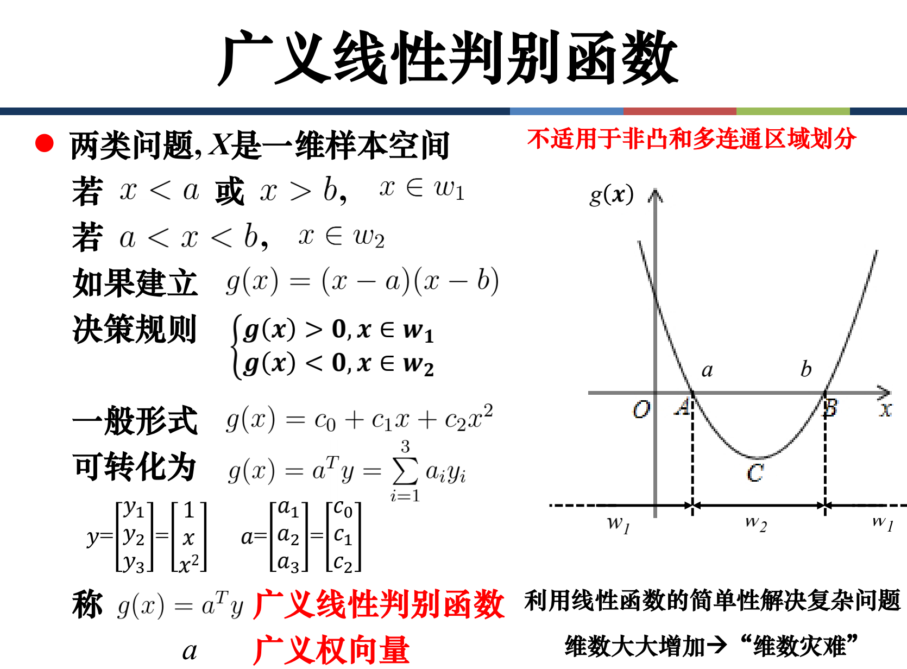
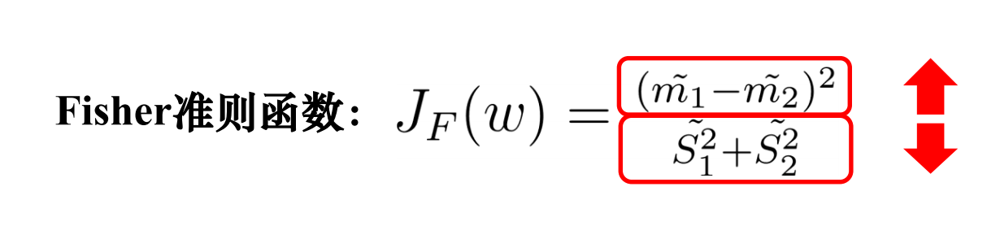
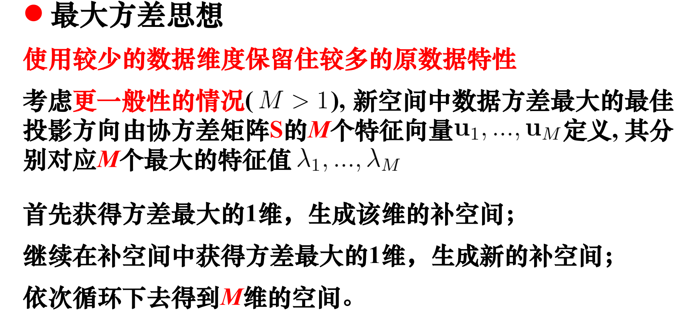
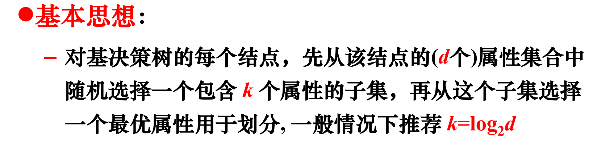
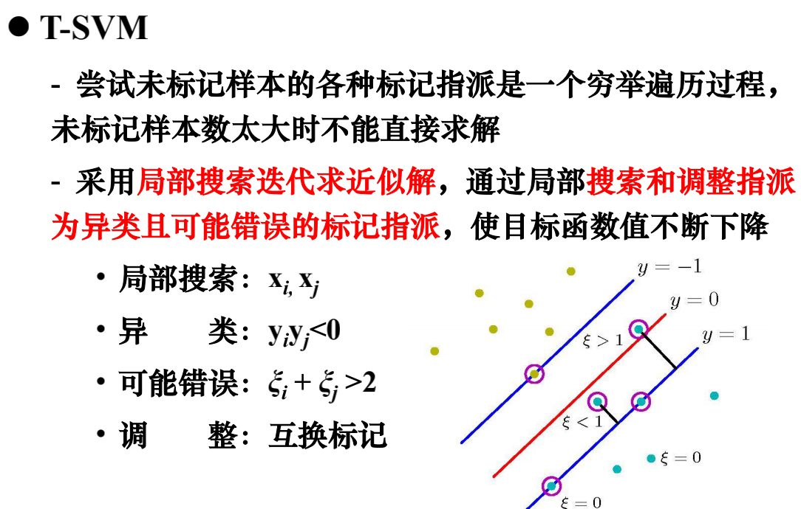

# 贝叶斯决策

### 贝叶斯公式

**先验概率、后验概率**

### 最小错误率贝叶斯决策

### 最小风险贝叶斯决策

### 朴素贝叶斯决策

### 参数估计 - 极大似然估计

### 参数估计 - 贝叶斯估计

# 线性回归

### 梯度下降

### 标准方程组

### 基函数

### 判别函数

### Fisher准则

### 感知机准则

对于$y^{(i)}$，若$a(1)^Ty^{(1)}<0$则更新$a(2)^T=a(1)^T+y^{(1)}$，否则不更新。

 结果不唯一，线性不可分的情况下不收敛

# 支持向量机

### 噪声和离群点

### 非线性SVM

对于非线性可分的数据样本，通过适当的函数变换，将其在高维空间中转化为线性可分。

# 决策树

### 信息熵

### ID3算法

选择节点特征：

$f(x)$ denote $xlog_2(x)$

* 计算$H(D)=\sum f(\frac{各类别样本数量}{总样本数量})$
* 对于每个特征$x$：
  * 对于该特征的每个取值$x_i$，计算$H(D^{x_i})=\sum f(\frac{x_i样本中各类别样本数量}{x_i样本数量})$
  * 计算特征$x$的信息增益$G(D^x)=H(D)-\sum f(\frac{x_i样本数量}{总样本数量})H(D^{x_i})$

* 若最大信息增益大于阈值则选择其特征；否则选择样本中最多的类作为标记

### 预剪枝算法

### 后剪枝算法

### 连续值处理

### 缺失值处理

# 神经网络

# 聚类

# 数据降维

# 集成学习

### Boosting

### Bagging

### 随机森林

### 结合策略

# 半监督学习

### 学习法

### 半监督SVM

### 半监督聚类

* 约束K均值 —— 利用第一类监督信息

* 约束种子K均值 —— 利用第二类监督信息

