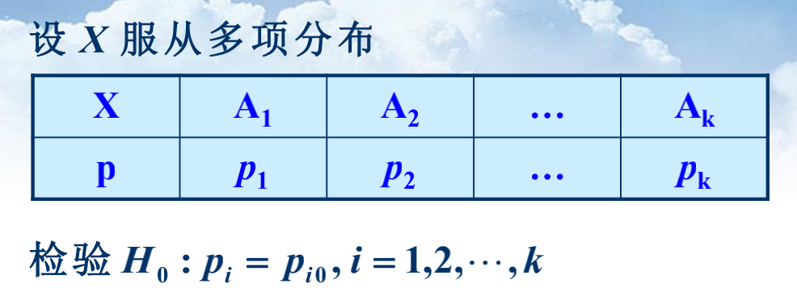

# 12假设检验

### 假设检验原理

 ## 正态分布假设检验

### σ^2^已知，检验μ

双边检验

单边检验

### σ^2^未知，检验μ

### μ未知，检验σ^2^

双边检验

单边检验

## 两正态总体

### 方差σ~1~^2^,σ~2~^2^已知，检验μ~1~=μ~2~

### 方差未知但σ~1~^2^=σ~2~^2^，检验μ~1~=μ~2~

### μ~1~, μ~2~未知，检验σ~1~^2^=σ~2~^2^

## 总体分布的Q-Q图检验

P23

## 皮尔逊的拟合优度检验

两点分布（伯努利实验）的参数检验P24

### 多项分布的参数检验

### 对分布的检验

## 列联表的独立性检验

**假设独立**

皮尔逊检验统计量

**对2×2列联表**：

＞X^2^(1)=3.84：拒绝，有关；否则无关