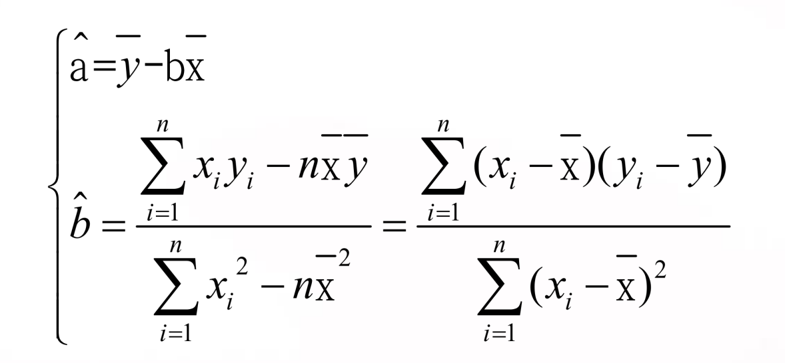

# 13线性回归

## 数据的相关性

### Perason相关系数

r绝对值接近1强相关，接近0弱相关

正：正相关，负：负相关

### 线性相关检验

## 回归直线

### 残差平方和

### 回归方程

最小二乘估计；

### σ^2^的无偏估计

极大似然估计与最小二乘法估计一样

### LS估计的性质

### 参数a,b置信区间

### 离差平方和分解

回归方程、回归系数显著性检验：P28、P29

### 预测置信区间

控制y的区间P33

