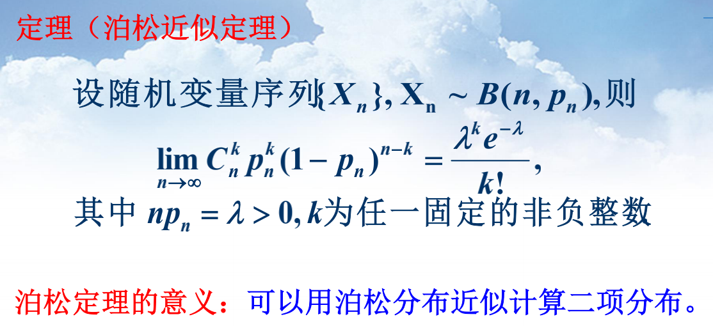

# 3概率公式

何书附录

## 随机变量及分布函数

随机变量P1

分布函数P5

分布函数：单调不减，极限为0和1，间断点右连续

## 离散型随机变量

两点分布

### 二项分布（n重贝努利试验）

### 泊松分布

λ=μt，μ为到达强度，t是区间长度

泊松近似定理

用λ=np近似计算二项分布

例题

### 几何分布

### 超几何分布

**大样本时不放回近似为放回，二项分布p=N/(M+N)**

### 负二项分布

## 连续型随机变量

概率密度函数

概率密度：非负、归一

### 均匀分布

### 指数分布

### 伽马分布

### 威布尔分布

### 正态分布

σ越大，曲线越分散

### 标准正态分布

正态分布与标准正态分布的关系：

标准正态分布的α分位点

标准正态分布表、α分位表：书P305

## 随机变量函数的分布

### 离散型P47

### 连续型：

要求y对x单调，反函数有连续导函数

中心矩、原点矩

