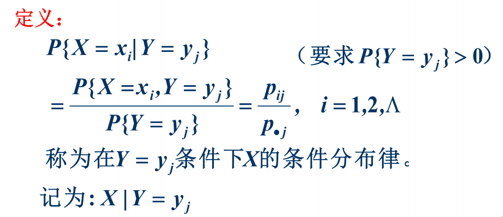

# 4随机向量

随机向量定义P1

## 随机向量、联合分布

### 联合分布函数

性质：

单调性、有界性（无穷处为0、1）、右连续、非负性

### 边际分布与独立性

### 离散型随机变量的联合分布列

### 连续型随机变量的联合密度函数

密度函数

密度函数性质：非负、归一、连续时等于分布函数导数

**边缘密度**

独立性

## 随机向量函数的分布

离散型P2

连续型

### 1、基本思路

### 2、和分布Z=X+Y

例：两正态分布的和P10

### 3、Z=max(X,Y), Z=MIN(X,Y)

max

min

分析串并联系统P18（串联min，并联max）

### 4、向量变换法（二维→二维）

例题P20

### 5、增补变量法

积公式P23

商公式P24

## 条件分布与条件期望

### 离散型条件分布

### 二维连续型分布

例：二维正态分布P50

 ### 连续场合的全概率公式、贝叶斯公式

### 条件期望

重期望公式

**随机独立和P60**

## 二维正态分布

边沿密度：

X，Y相互独立充要条件：ρ=0

**多个正态分布线性组合**：

