# 5数字特征

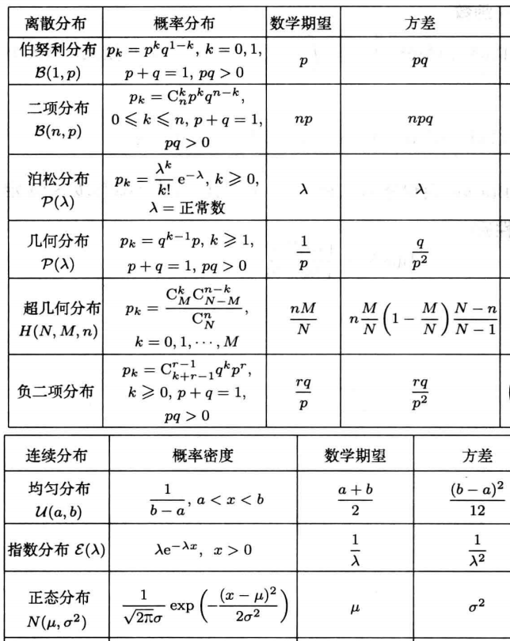

## 数学期望

### 离散型

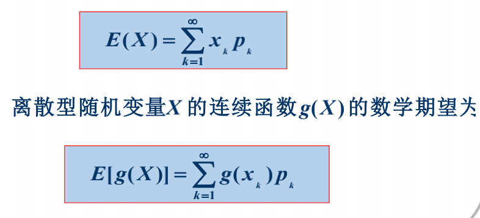

### 连续型

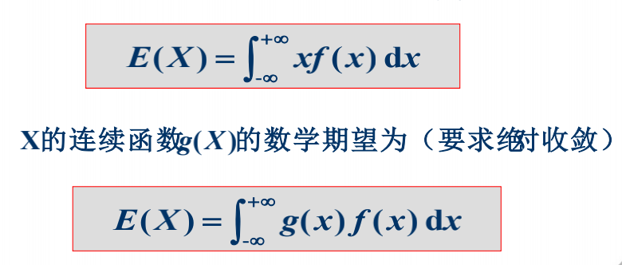

检查绝对收敛性P8

### 多维随机变量

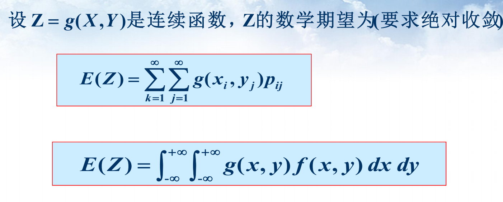

## 数学期望的性质

线性、独立性、单调性

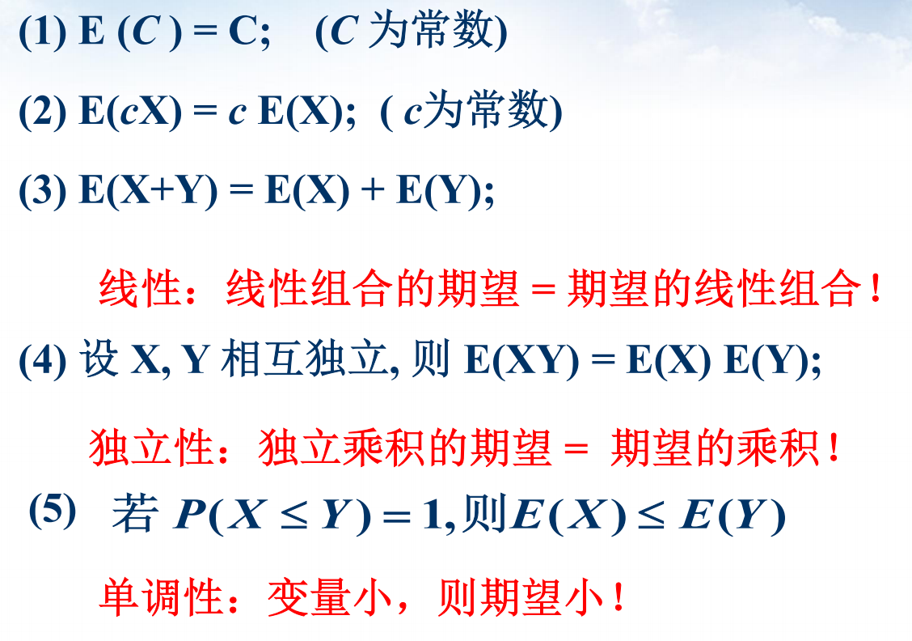

例：

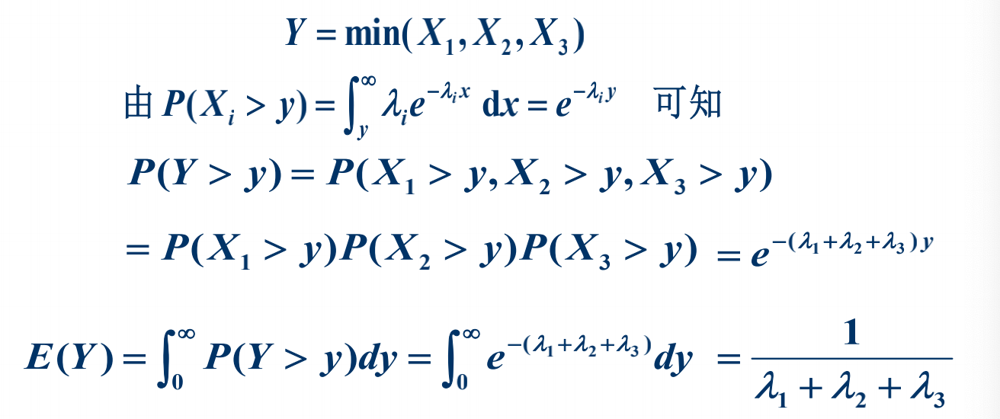

## 方差

### 方差定义

### 方差性质

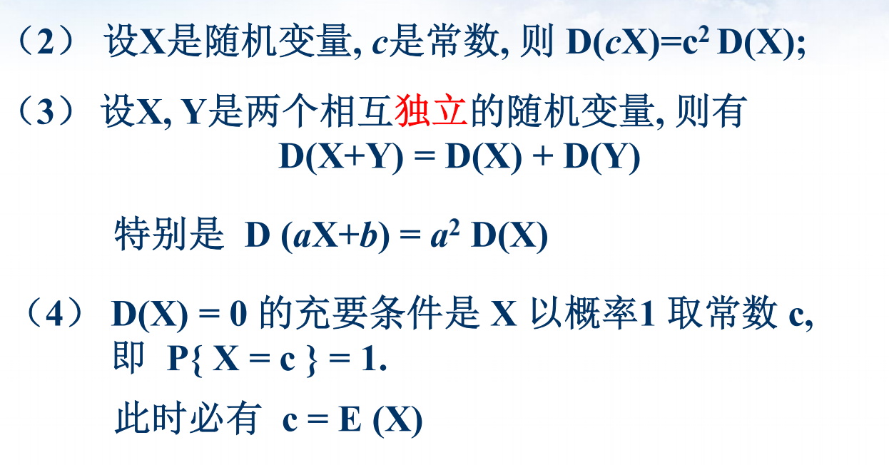

## 协方差和相关系数

### 协方差定义

### 协方差性质

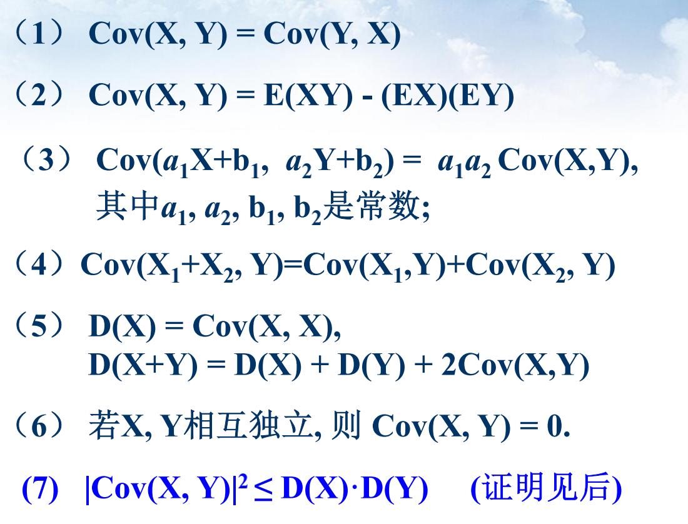

### 二维正态分布

协方差ρσ~1~σ~2~，相关系数ρ，XY独立<=>XY不相关<=>ρ=0

### 不相关和独立

独立一定不相关，不相关未必独立

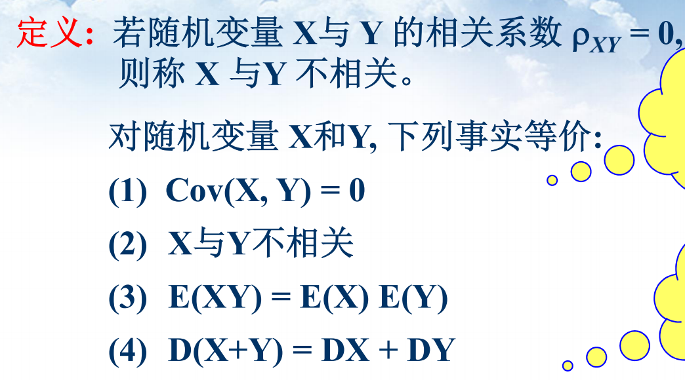

## 矩、协方差矩阵

### 矩

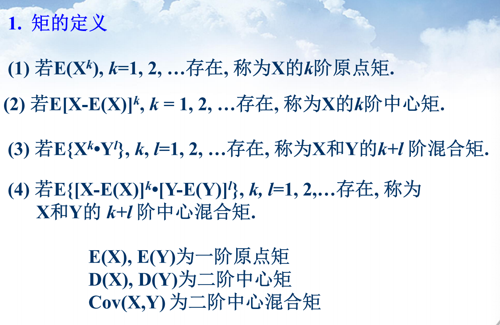

### 协方差矩阵

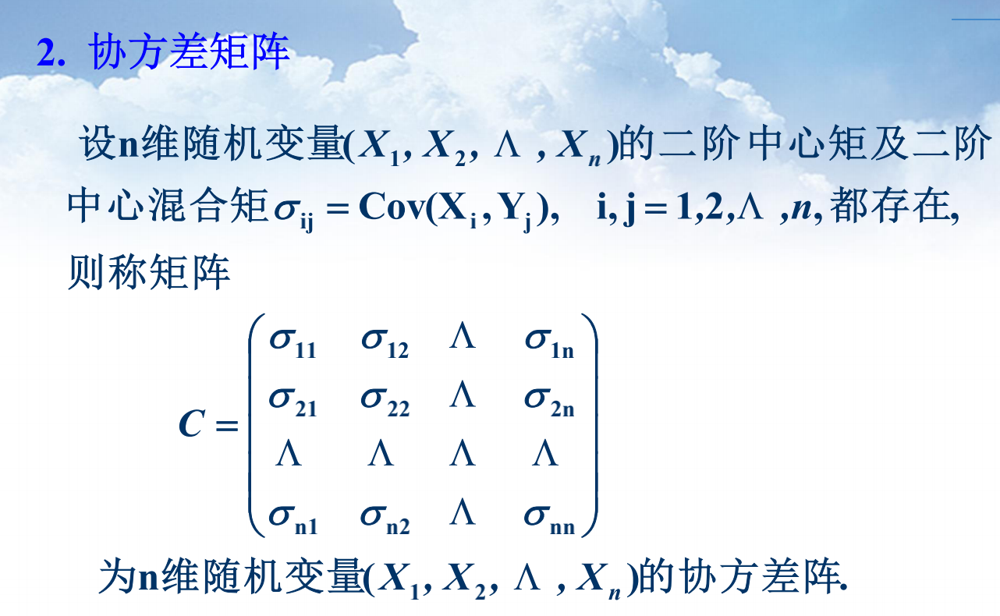

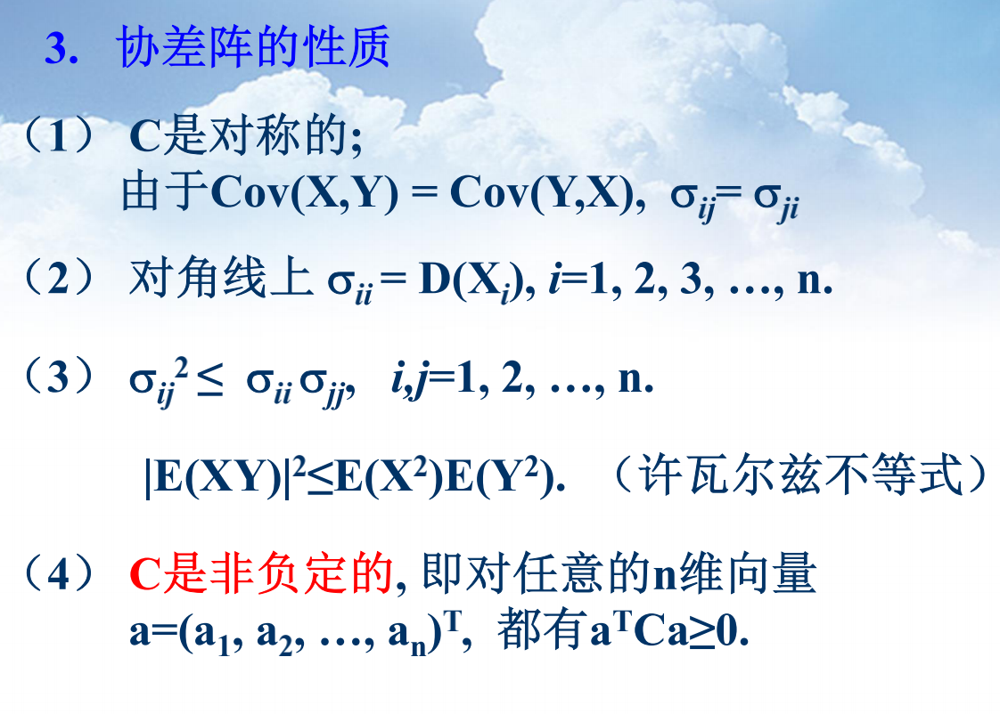

n维正态分布P51