# 6极限定理

## 随机变量序列收敛性

### 依概率收敛

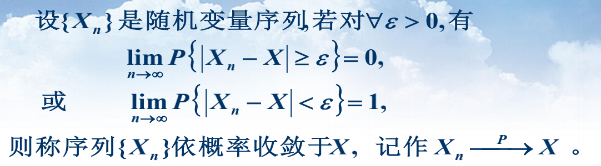

符合四则运算

### 依分布收敛（弱收敛）

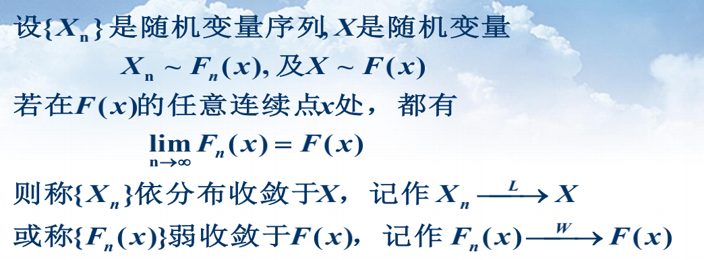

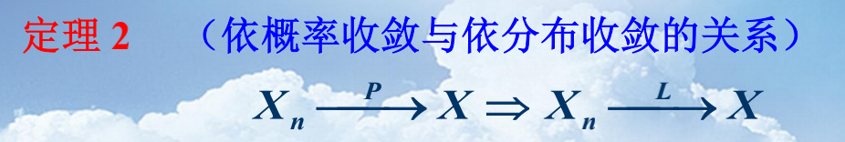

## 大数定律

### 切比雪夫不等式

### 伯努利大数定律

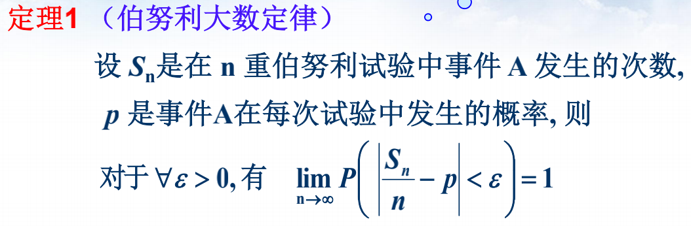

### 大数定律

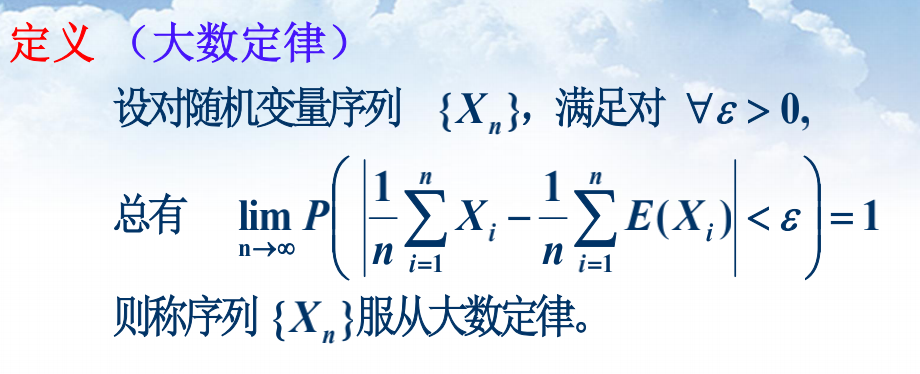

随机变量的算术平均依概率收敛于相应期望的算术平均

### 切比雪夫大数定律

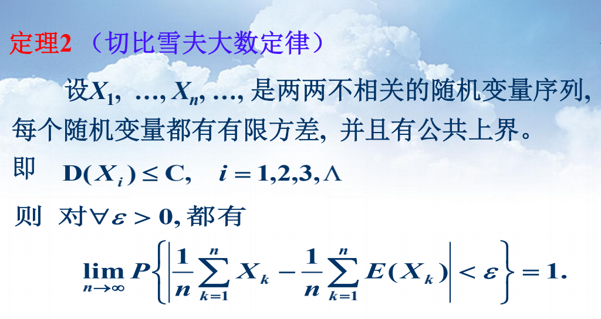

### 马尔可夫大数定律

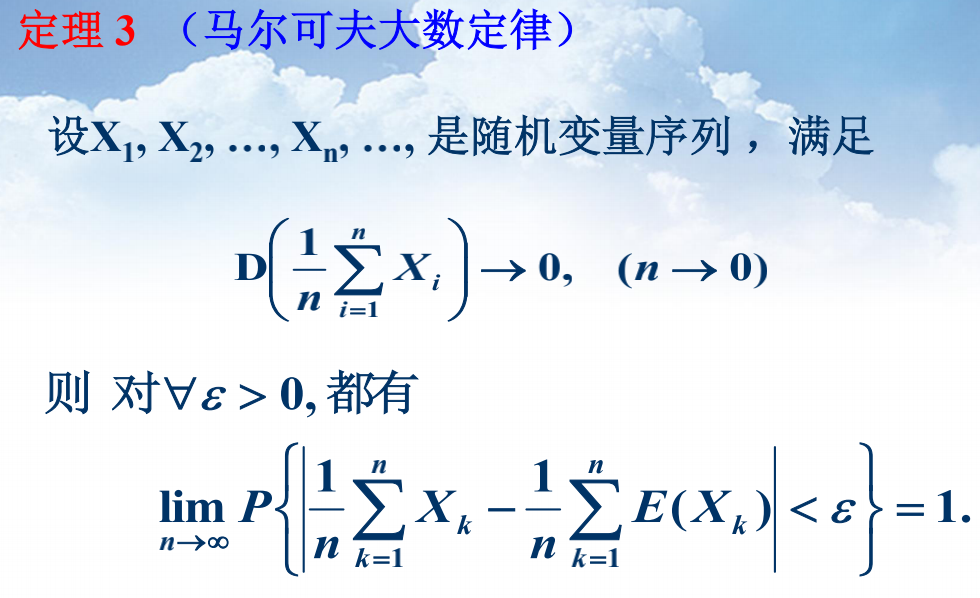

### 辛钦大数定律

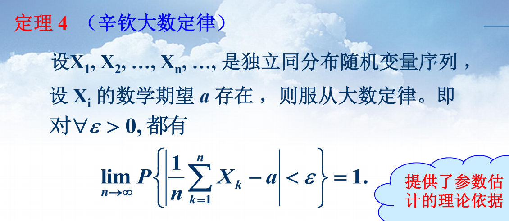

## 中心极限定理

### 独立同分布

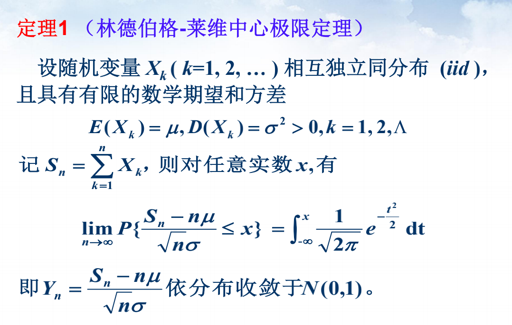

### 二项分布的正态近似

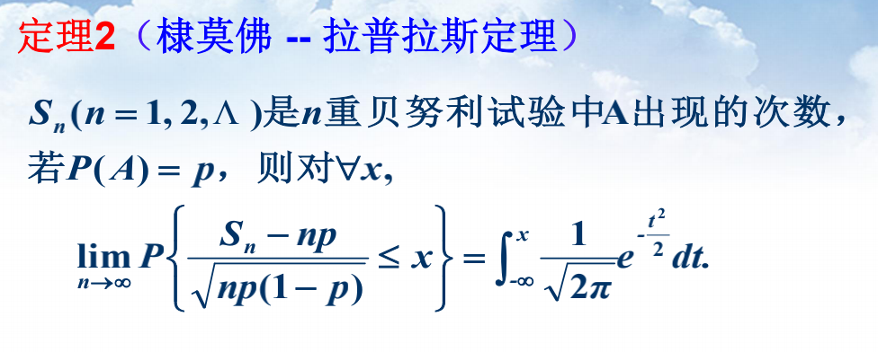

近似修正：

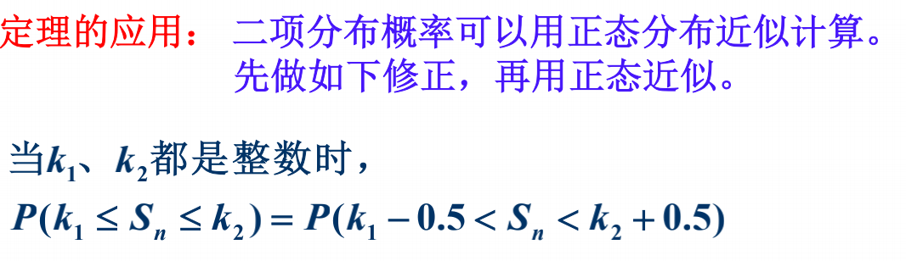

### 独立但不同分布

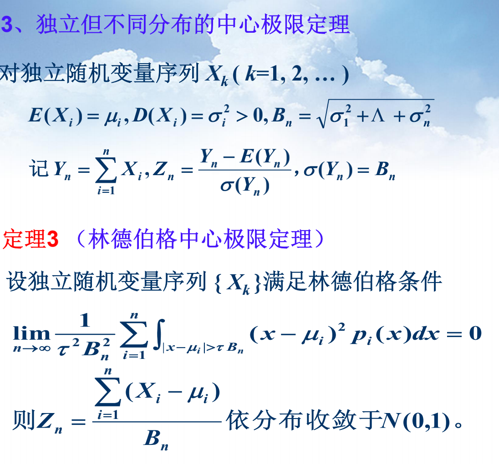

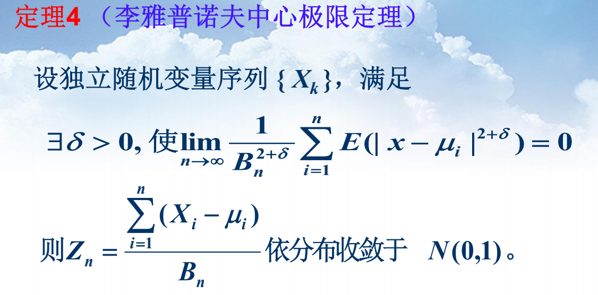

