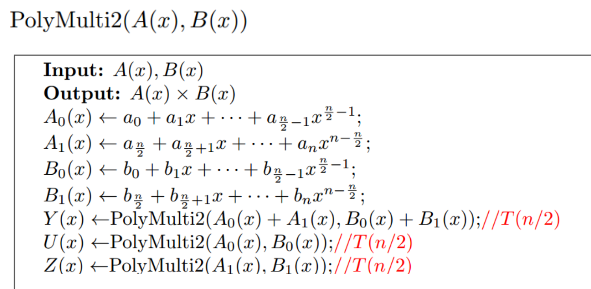
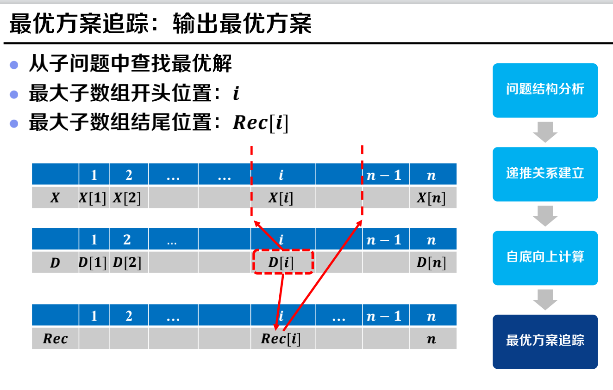
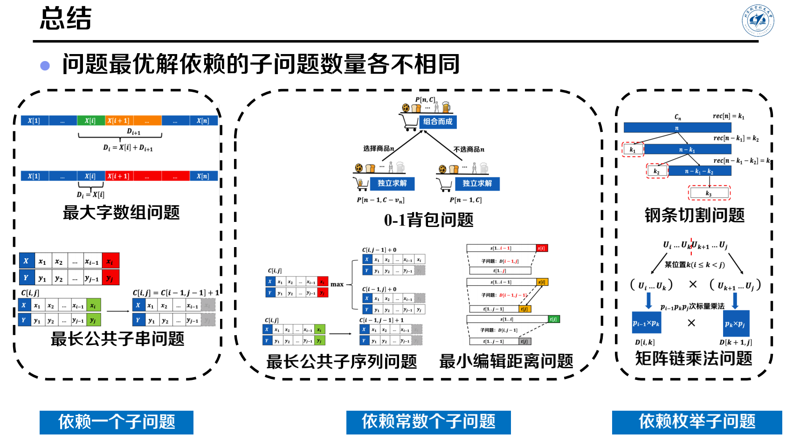
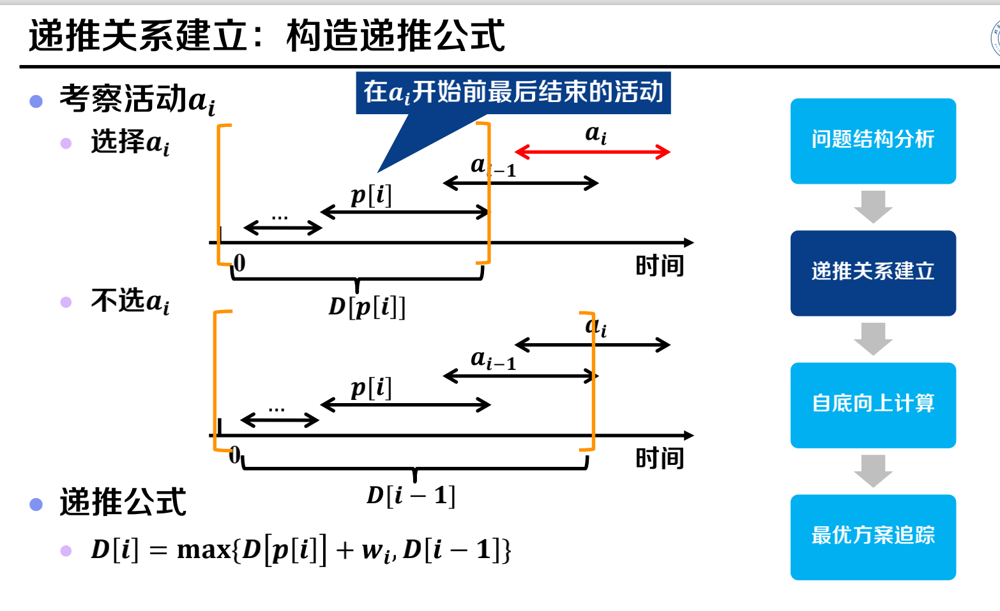
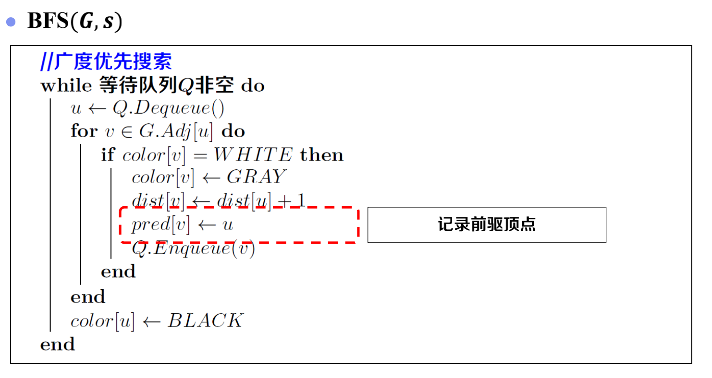
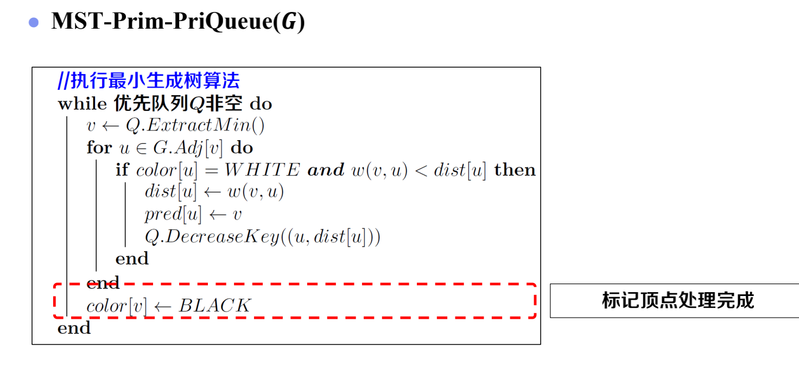

# 基础

渐进下界：Ω

渐进约束：θ

## 递归式复杂度求解

代入法：数学归纳法证明$T(n)<cn^2$

**主定理**

# 分治算法

### 逆序对计数

### 矩阵乘法

### 快速排序

### 次序选择

### 堆

# 动态规划

### 01背包

### 最大连续子数组

### 最长公共子序列

### 最长公共子串

### 最小编辑距离

### 钢条切割

### 矩阵链乘法

# 贪心

证明贪心策略正确：证明贪心解不劣于最优解（找到第一个贪心与最优解不同的位置，替换，证明变好）

### 带权活动选择问题

# 图

树：连通无环图

### BFS

### DFS

### 环路检测

### 拓扑排序

### 强连通分量

### 最小生成树 - Prim

未优化

优先队列优化

### 最小生成树 - Kruscal

 ### 最短路径 - Dijkstra

### 负权最短路径 - Bellman-Ford

| 算法                     | 复杂度              |
| ------------------------ | ------------------- |
| 归并排序                 | nlogn               |
| 最大连续子数组           | n                   |
| 逆序对计数               | nlogn               |
| 矩阵乘法                 | n^log3^             |
| 快速排序                 | 期望nlogn，最坏n^2^ |
| 次序选择                 | 期望n，最坏n^2^     |
| 堆排序                   | nlogn               |
|                          |                     |
| 01背包                   | nc                  |
| 最大连续子数组           | n                   |
| 最长公共子序列           | nm                  |
| 最长公共子串             | nm                  |
| 最小编辑距离             | nm                  |
| 钢条切割                 | n^2^                |
| 矩阵链乘法               | n^3^                |
|                          |                     |
| 部分背包                 | nlogn               |
| 赫夫曼编码               | nlogn               |
| 活动选择                 | nlogn               |
| 带权活动选择             | nlogn               |
|                          |                     |
| BFS                      | V+E                 |
| DFS                      | V+E                 |
| 环路检测                 | V+E                 |
| 拓扑排序                 | V+E                 |
| 强连通分量               | V+E                 |
| 未优化Prim               | V^2^+E              |
| 优先队列Prim             | ElogV               |
| 并查集Kruskal            | ElogV               |
| 单源最短路径Dijkstra     | ElogV               |
| 负权最短路径Bellman-Ford | EV                  |
|                          |                     |
| 优先队列 extract min     | logn                |
| 优先队列 decrease key    | logn                |
| 并查集 create set        | 1                   |
| 并查集 find set          | logn                |
| 并查集 union set         | logn                |

# P和NP

### input size

对于正整数$n$，input size为$log_2n$

$n$个正整数排序，input size为$n*log_2max(a_i)$

DFS，input size为n+e

### P和NP

优化问题有对应的决策问题

证书：用来证明yes-input的物体

P：存在一个算法可以在多项式时间内决定某输入是yes-input或no-input

NP：对于每个yes-input，存在证书能在多项式时间内验证其为yes-input

### 归约（Reduction）

Q可以重新解读为Q'的实例，则Q难度≤Q'

* 多项式时间归约：
  * （1）L1的输入x可以通过归约变换为L2的输入f(x)，满足yes映射到yes，no映射到no
  * （2）f(x)可在多项式时间内计算
  * 表示L1难度小于L2（解决L1只需变换到L2再解决L2）

* 比较定理

* 传递性

### NP-Complete

如果有一个NPC问题可多项式时间解决，则所有NP都可多项式时间解决

如果有一个NPC问题不可多项式时间解决，则所有NPC都不能多项式时间解决

要么所有NPC都多项式时间可解，要么都不可解

### NPC优化和决策

如果决策问题可以多项式时间解决，那么对应优化问题也可以

如果决策问题不能多项式时间解决，那么对应优化问题也不能

### NP-Hard

NPC中问题可以多项式归约到的问题（NP-Hard不一定属于NP）

NPC优化问题是NP-Hard

### 问题分类

P

* 乘法
* DFS
* Kruskal、DST决策生成树
* 环路检测
* 判断连通图是否是树
* 2-SAT

NP

* Composite判断合数（只需除数）
* DSubsetSum子集和问题（只需下标集合）
* DMST
* Dknapsack

NPC

* 01背包 
* SAT布尔表达式可满足性（只需一些0和1使表达式值为1）
* 3-SAT（三项主合取范式）
* DCLIQUE 团（完全子图）
* DVC 顶点覆盖（只需顶点集合）
* DIS 独立集（任意两点不相邻）

